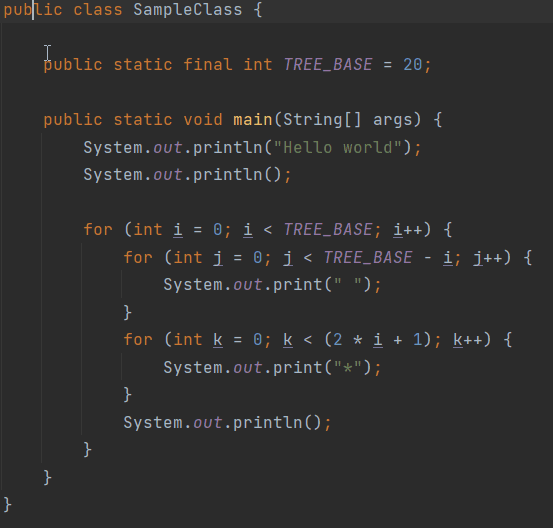
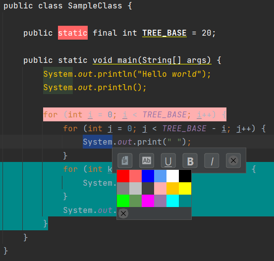

# Simple Editor

Simple Editor is a plugin for JetBrains IntelliJ IDEA that lets you highlight, color, apply other style to selected text.

Displays a popup window with available styles that you can use to style selected text.

<kbd>

</kbd>

  

<kbd>

</kbd>
